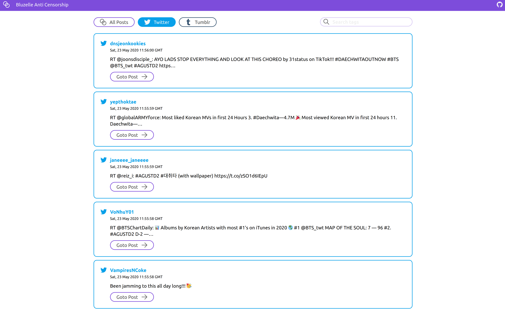
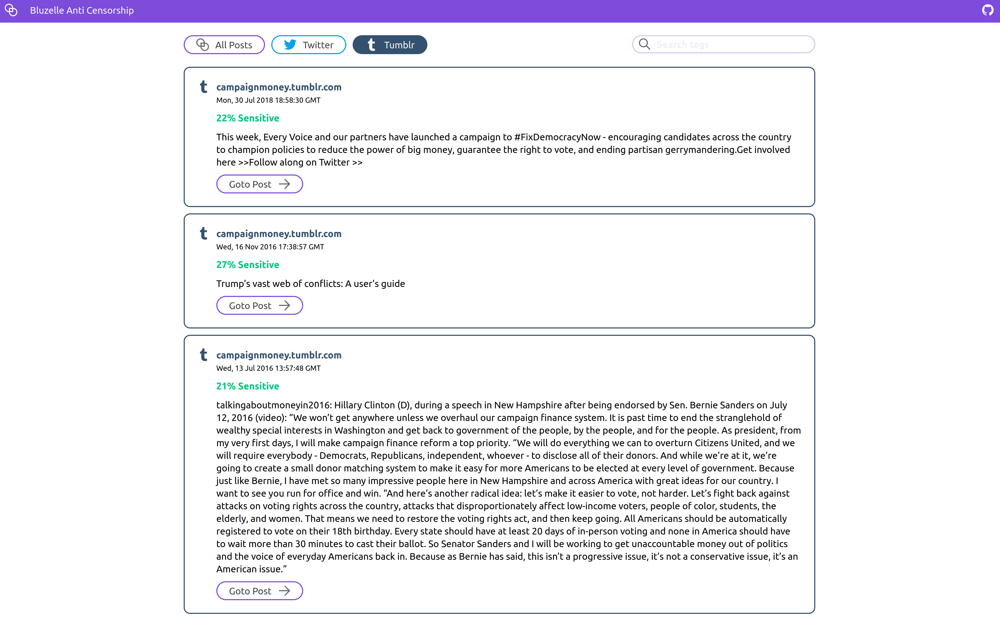

# anti-censorship

An anti-censorship application where we store data which is likely to be censored forever using bluzelle database

## Twitter

Twitter has a really bad rep when it comes to censoring, thousands of people have accused Twitter of censoring topics at times often due to government pressure.

1. https://www.cnbc.com/2020/02/07/hashtag-censored-after-coronavirus-whistleblower-doctors-death.html
2. https://qz.com/india/1753116/modi-government-ramps-up-twitter-facebook-censorship/
3. https://thewire.in/media/modi-govt-twitter-removal-requests
4. https://www.aljazeera.com/news/2019/10/twitter-accused-censoring-free-speech-kashmir-191030140205682.html

Many countries in the world raise their voices against injustice through these social platforms. We see trending topics against govt often on twitter but did you know that most of them gets taken down on govt's request. We want to gather these tweets and information and put it on bluezelle db (immortalizing it) before it gets taken down.

To do that, our platform fetches top 10 trending topics in any particular location (https://buffer.com/resources/five-twitter-secrets-about-censored-trending-topics) and then listens for tweets containing those tags. So for example if we get trending tweets in Wuhan, China and we get trending topics like "#ChinaLies" or something then we will listen for tweets on this particular tag and save their content on bluezelle along with tag name.

So whenever people anywhere in the world, wants to tell something they would just have to tweet about it and we will listen and mkae sure that there voices remain throughout time.

## Tumblr

Tumblr another great social platform is no different than twitter (although less prone to censoring comparatively) regarding censoring stuff. It's recent NSFW ban was highly criticized everywhere as "Tumblr had always been a safe space for subversive deviance and unrepressed explorations of identity and sexuality".

1. https://www.nytimes.com/roomfordebate/2013/08/19/can-free-speech-and-internet-filters-co-exist/corporate-censorsip-is-untouched-by-the-first-amendment
2. https://www.eff.org/deeplinks/2018/12/dear-tumblr-banning-adult-content-wont-make-your-site-better-it-will-harm-sex
3. https://www.vox.com/2018/12/4/18124120/tumblr-porn-adult-content-ban-user-backlash

We are saving content on bluzelle which might get censored on tumblr like NSFW, Political posts etc.

## Local Env Setup

Please refer to [CONTRIBUTING.md](https://github.com/nanspro/anti-censorship) to see contribution instructions and local env setup.
